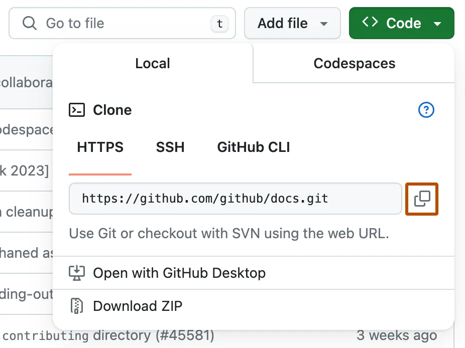

> :sparkles: This page serves as Quickstart for working with repositories. For a more comprehensive reference about Working with GitHub repositories, refer to [Creating and managing repositories](https://docs.github.com/en/repositories/creating-and-managing-repositories)

## Repository terminology

A repository is the most basic element of GitHub. Before getting started with repositories, learn these important terms.

| Term | Definition |
| ---- | ---------- |
| Branch | A parallel version of your code that is contained within the repository, but does not affect the primary or main branch. |
| Clone | To download a full copy of a repository's data from GitHub, including all versions of every file and folder. |
| Fork | A new repository that shares code and visibility settings with the original "upstream" repository. |
| Merge | To take the changes from one branch and apply them to another. |
| Pull request | A request to merge changes from one branch into another. |
| Remote | A repository stored on GitHub, not on your computer. |
| Upstream | The branch on an original repository that has been forked or cloned. The corresponding branch on the cloned or forked branch is called the "downstream." |
|||

## Cloning a repository

1. On GitHub.com, navigate to the main page of the repository.
2. Above the list of files, click **Code** button.
    
3. Copy the URL for the repository.
   - To clone the repository using **HTTPS**, under HTTPS, click _clipboard_ icon.
   - To clone the repository using an **SSH** key, including a certificate issued by your organization's SSH certificate authority, click SSH, then click _clipboard_ icon.
   - To clone a repository using **GitHub CLI**, click GitHub CLI, then click _copy_ icon.
    
4. Open **Git Bash**.
5. Change the current working directory to the location where you want the cloned directory.
6. Type `git clone`, and then paste the URL you copied earlier.

```markdown
git clone https://github.com/YOUR-USERNAME/YOUR-REPOSITORY
```

7. Press **Enter** to create your local clone.

```bash
$ git clone https://github.com/YOUR-USERNAME/YOUR-REPOSITORY
> Cloning into `Spoon-Knife`...
> remote: Counting objects: 10, done.
> remote: Compressing objects: 100% (8/8), done.
> remove: Total 10 (delta 1), reused 10 (delta 1)
> Unpacking objects: 100% (10/10), done.
```

## Sources

1. <cite>[About repositories][1]</cite>
2. <cite>[Cloning a repository][2]</cite>

[1]: https://docs.github.com/en/repositories/creating-and-managing-repositories/about-repositories
[2]: https://docs.github.com/en/repositories/creating-and-managing-repositories/cloning-a-repository