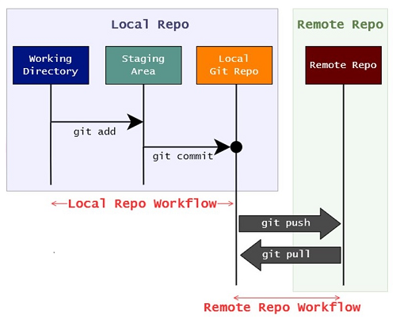

## Git cheat sheet

This Git cheat sheet saves you time when you just can't remember what a command is or don't want to use git help in the command line. It is hard to memorize all the important Git commands by heart, so print this out or save it to your desktop to resort to when you get stuck. Source: [Git cheat sheet](https://www.atlassian.com/git/tutorials/atlassian-git-cheatsheet).

You can download it using this [link](../../static/files/Atlassian-Git-Cheatsheet.pdf).

## Basic Git commands

To use Git, developers use specific commands to copy, create, change, and combine code. These commands can be executed directly from the command line or by using an application like GitHub. Here are some common commands for using Git:

- [`git init`](https://www.atlassian.com/git/tutorials/setting-up-a-repository/git-init) initializes a brand new Git repository and begins tracking an existing directory. It adds a hidden subfolder within the existing directory that houses the internal data structure required for version control.
- [`git clone`](https://www.atlassian.com/git/tutorials/setting-up-a-repository/git-clone) creates a local copy of a project that already exists remotely. The clone includes all the project's files, history, and branches.
- [`git commit`](https://www.atlassian.com/git/tutorials/saving-changes/git-commit) saves the snapshot to the project history and completes the change-tracking process. In short, a commit functions like taking a photo. Anything that's been staged with `git add` will become a part of the snapshot with `git commit`.
- [`git branch`](https://www.atlassian.com/git/tutorials/using-branches) shows the branches being worked on locally.
- [`git merge`](https://www.atlassian.com/git/tutorials/using-branches/git-merge) merges lines of development together. This command is typically used to combine changes made on two distinct branches.
- [`git pull`](https://www.atlassian.com/git/tutorials/syncing/git-pull) updates the local line of development with updates from its remote counterpart. Developers use this command if a teammate has made commits to a branch on a remote, and they would like to reflect those changes in their local environment.
- [`git push`](https://www.atlassian.com/git/tutorials/syncing/git-push) updates the remote repository with any commits made locally to a branch.

For more information, see the [full reference guide to Git commands](https://git-scm.com/docs).

## Git Workflow

The Git Workflow involves a series of steps to manage changes to a codebase in **local** and **remote** repositories. The Git workflow involves working with three main components:

1. **Local Repository:** The local repository is where all the Git operations take place on your local machine. It contains the entire history of the project, including all commits, branches, and files. When you initialize a new repository using `git init` or clone an existing repository using `git clone`, you create a local repository.
2. **Staging Area (Index):** The staging area, also known as the index, is an intermediate area where you prepare changes to be committed to the repository. Before making a commit, you stage the changes using the `git add` command, which moves the changes from the working directory to the staging area. This allows you to selectively include specific changes in the next commit while excluding others.
3. **Remote Repository:** The remote repository is a centralized repository hosted on a server (e.g., GitHub, GitLab, Bitbucket) that serves as a collaboration and backup point for the project. Developers can push their local commits to the remote repository to share their work with others and synchronize changes with team members.



## Example: Contribute to an existing repository

- Make Changes: You can make changes to the codebase by modifying existing files, adding new files, or deleting files as needed to implement new features, fix bugs, or make improvements.
- Stage Changes: After making changes, developers use the git add command to stage the modified files for the next commit. Staging allows developers to selectively include specific changes in the next commit while excluding others.
- Review Changes: Before committing the staged changes, developers can review the changes using the git diff command to see the differences between the working directory and the staging area. This helps ensure that only the intended changes are included in the commit.
- Commit Changes: Once satisfied with the staged changes, developers use the git commit command to create a new commit. Commits are snapshots of the codebase at a specific point in time and include a message that describes the purpose of the changes.
- Write Commit Message: When creating a commit, developers provide a descriptive commit message that explains the purpose of the changes. A well-written commit message is concise, clear, and provides context for the changes being made.
- Repeat: Developers continue making changes to the codebase, staging them, and committing them as needed. Each commit represents a discrete set of changes and should be focused on a single task or purpose.


```bash
# download a repository on GitHub to our machine
# Replace `owner/repo` with the owner and name of the repository to clone
git clone https://github.com/owner/repo.git

# change into the `repo` directory
cd repo

# create a new branch to store any new changes
git branch my-branch

# switch to that branch (line of development)
git checkout my-branch

# make changes, for example, edit `file1.md` and `file2.md` using the text editor

# stage the changed files
git add file1.md file2.md

# take a snapshot of the staging area (anything that's been added)
git commit -m "my snapshot"

# push changes to github
git push --set-upstream origin my-branch
```

## Sources

1. <cite>[Basic Git commands][1]</cite>
2. <cite>[Git cheat sheet][2]</cite>

[1]: https://docs.github.com/en/get-started/using-git/about-git#basic-git-commands
[2]: https://www.atlassian.com/git/tutorials/atlassian-git-cheatsheet