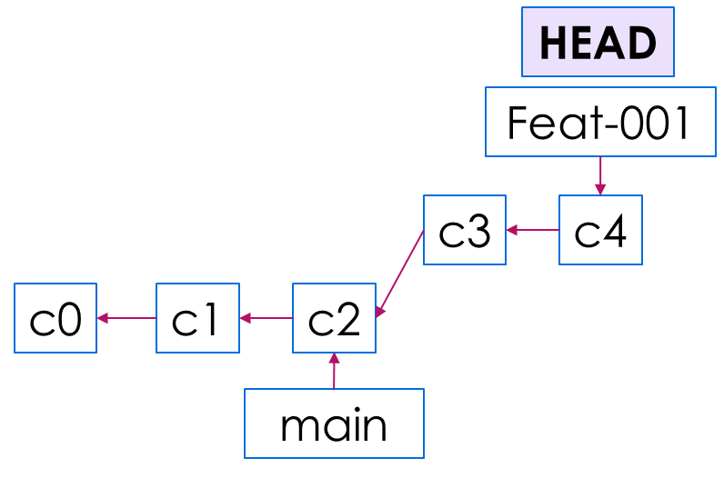
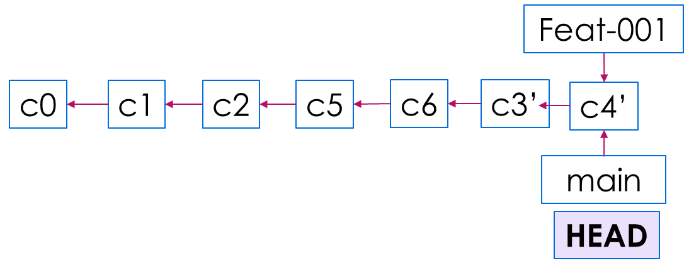

## Mastering Git Branch Strategies: Seamless Version Control for Efficient DevOps

Git branches serve as pointers to specific snapshots of your codebase, allowing you to work on new features, fixes, or experiments without directly modifying the main codebase. By creating a new branch for each task or change, you isolate your work from the main branch (e.g., master), reducing the risk of introducing unstable or incomplete code into the production environment.

Branching also provides several benefits:

- **Isolation:** Each branch represents a separate line of development, allowing you to work on changes independently without interfering with other ongoing work or the stability of the main branch.
- **Collaboration:** Branches facilitate collaboration among team members by allowing them to work on different features or fixes simultaneously. Once a branch is complete, it can be reviewed and merged back into the main branch.
- **Experimentation:** Branches provide a safe space for experimentation and prototyping. You can create temporary branches to test new ideas, explore alternative solutions, or conduct performance optimizations without affecting the main codebase.
- **History Cleanup:** Before merging a branch into the main branch, you have the opportunity to clean up its commit history, ensuring that the commit log remains clean and meaningful. This helps maintain a clear and comprehensible history of changes over time.

[](https://www.youtube.com/watch?v=S2TUommS3O0)

## What is Git Branching?

Git branching is a powerful feature of the Git version control system that allows developers to create separate branches within a repository. Each branch can contain its own set of changes, which can be worked on independently without affecting the main codebase. This approach enables multiple developers to work on different features or bug fixes simultaneously, providing a flexible and efficient workflow. Branching makes it easier to manage different lines of development, experiment with new ideas, and maintain a clean and organized project history.

## Getting Started with Git Branches

When you create a branch in Git, you essentially create a new pointer to the current commit. This new branch can diverge from the main line of development, allowing you to make changes without impacting the original code. You can switch between branches using the `git checkout` command, which updates your working directory to reflect the state of the selected branch. Once your work on a branch is complete, you can merge it back into the main branch, combining the changes from both branches. Git also provides tools to handle conflicts that may arise during the merge process, ensuring a smooth integration of different development efforts. 

Below you can find basic steps that can get you started:

1. **Understand the Basics:** Familiarize yourself with the basic concepts of Git, including repositories, commits, branches, and merges. Learn how to install Git on your system and set up a new Git repository for your project.
2. **Create a New Branch:** Use the git branch command to create a new branch in your Git repository. replace `<branch-name>`  with your branch name and run:

    ```bash
    git branch <branch-name>
    ```

3. **Switch to the New Branch:** Use the git checkout command to switch to the newly created branch. For example:

    ```bash
    git checkout <branch-name>
    ```

4. **Make Changes:** Make changes to your code in the new branch. You can add, modify, or delete files as needed to implement your new feature or fix.

5. **Commit Your Changes:** Use the git add and git commit commands to stage and commit your changes to the branch. For example:

    ```bash
    git add .
    git commit -m "Implemented new feature"
    ```

6. **Merge Branches:** Once you've completed your changes and tested them, you can merge the changes back into the main branch (e.g., master). First, switch to the target branch:

    ```bash
    git checkout main # or master
    ```

    Then, merge the feature branch into the main branch:

    ```bash
    git merge <branch-name>
    ```

7. **Resolve Conflicts (if any):** In case of conflicts between changes made in different branches, Git will prompt you to resolve them manually. Use a text editor to resolve conflicts, then add and commit the changes.
8. **Delete Branch:** After merging the changes, you can delete the feature branch using the -d option:

    ```bash
    git branch -d <branch-name>
    ```

9. **Explore Advanced Branching Workflows:** Git offers advanced branching workflows such as GitFlow and feature branching strategies. Explore these workflows to learn more about how to organize and manage branches in larger projects.
10. **Practice and Experiment:** The best way to learn Git branching is by practicing and experimenting with different branching scenarios. Create test repositories, experiment with branching and merging, and familiarize yourself with various Git commands and options.

## Example1: create and contribute to a branch with Git CLI

This example assumes that you already have a git repository called `repo` on the machine and that a new branch has been pushed to GitHub since the last time changes were made locally.

```bash
# download a repository on GitHub to our machine
# Replace `owner/repo` with the owner and name of the repository to clone
git clone https://github.com/owner/repo.git

# change into the `repo` directory
cd <your-repo-name>

# create a new branch to store any new changes
git branch <new-branch>

# switch to that branch (line of development)
git checkout <new-branch>

# make changes, for example, edit `file1.md` and `file2.md` using the text editor

# stage the changed files
git add file1.md file2.md

# take a snapshot of the staging area (anything that's been added)
git commit -m "adds my snapshot"

# push changes to github
git push --set-upstream origin <new--branch>

# merge your branch with main
git checkout main
git merge <new-branch>
```

## Example2: Understand commit history in working with branches

This example assumes that you already know basics of working with git CLI and git branches.

1. Make sure in branch main. Check your last commit log.

    ```bash
    git checkout main
    git log -n 1
    ```

    Commit **HEAD** is now at your last commit to `main` branch. Let's call this `c2`

    


2. Create a new branch called `feat-001` and checkout to this branch.

    ```bash
    git checkout –b feat-001
    ```

    Commit **HEAD** after this command will be pointing to the last commit but in `feat-001` branch.

    

3. Complete your work on this feature branch and make sure to keep your branch up-to-date by regular commits. Let's assume you are at `c4` and ready to request your work to be reviewed and merged.

    ```bash
    git add feature-file1.py feature-file2.py ...
    git commit -m "adds feature files"
    ```

    Commit **HEAD** will remain on `feat-001` branch as you are working on your branch. It will always point to your last commit.

    

4. Now assume you have to make some important fixes in the `main` branch. So you check out to `main` and complete your work in a series of commits.

    ```bash
    git checkout main
    git add bug-fix-file.py
    git commit -m "adds bug fix file"
    ```

    Commit **HEAD** will now be on `main` branch as you are working on `main` branch. It will always point to your last commit.

    

5. Assume you have now decided to merge your `feat-001` to `main` branch. Checkout to `main` if you have not done so yet, and resolve conflicts if any.

    ```bash
    git checkout main
    git merge feat-001
    ```

    Commit **HEAD** will now be on `main` branch pointing to a new commit create after the `merge` action.

    

## Git branching Commit Log

Unlike what you might expect, commit history log is not chronologically sequenced. Time is not an abstract concept in git. Think of commit history log as a sequence of commit events, not timed events. Even though `c3` and `c4` happened before `c5` and `c6` but the sequence of commits will place them afterwards because merge event happened afterwards.




## Sources

1. [Creating and merging branches in Git](https://docs.github.com/en/get-started/using-git/about-git#basic-git-commands)
2. [Basic Git commands](https://www.atlassian.com/git/tutorials/using-branches)
