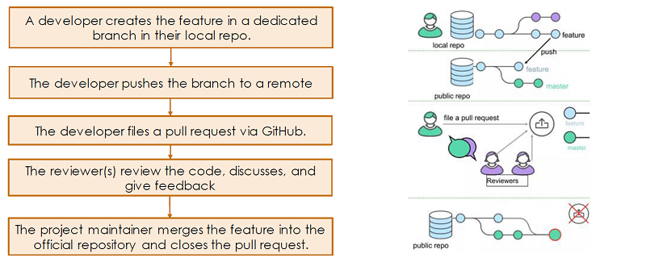
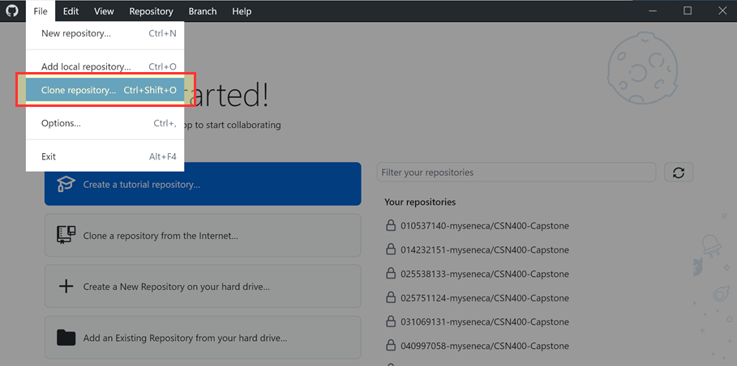
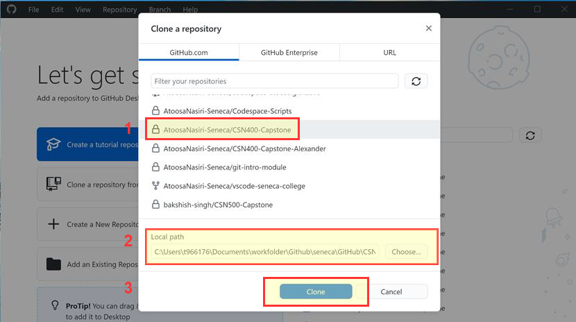
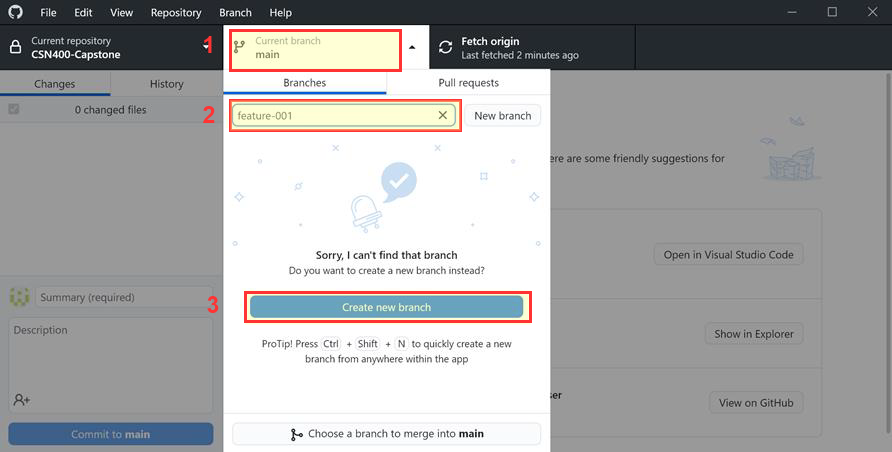
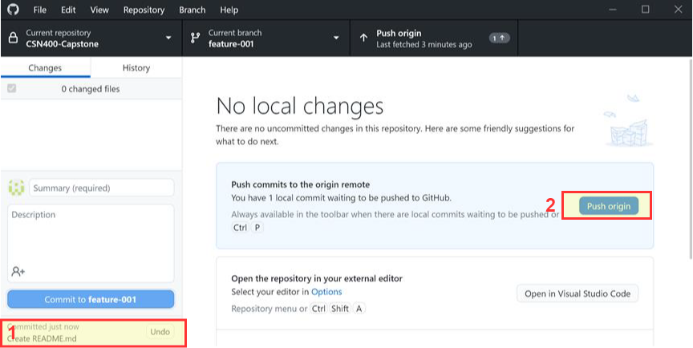
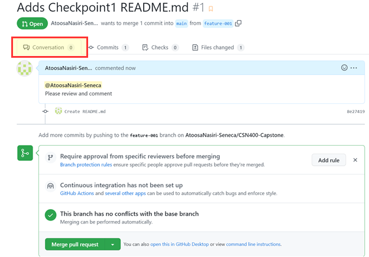
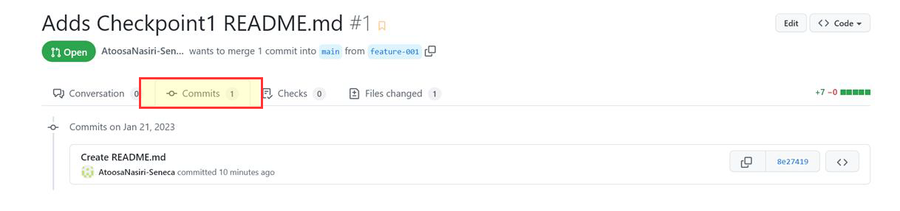

## What is Pull Request?

> A pull request is a proposal to merge a set of changes from one branch into another

Pull requests are a key feature of collaborative development on platforms like GitHub. They provide a structured way for developers to propose changes to a repository and facilitate communication, code review, and collaboration among team members.

When a pull request is opened, it serves as a discussion thread where developers can **review the proposed changes**, provide feedback, ask questions, and suggest improvements. The pull request workflow enables teams to ensure that changes meet quality standards, align with project goals, and integrate smoothly into the main codebase. By allowing for iterative discussion and refinement of changes before merging, pull requests help maintain code quality, prevent errors, and foster a culture of collaboration and transparency in software development projects.

## GitHub collaborative development models

The way you use pull requests depends on the type of development model you use in your project. You can use the **fork and pull model** or the **shared repository model**. Below you can find a brief description of each model:

### 1. Fork and pull model

In the fork and pull model, anyone can fork an existing repository and push changes to their personal fork. You do not need permission to the source repository to push to a user-owned fork. The changes can be pulled into the source repository by the project maintainer. When you open a pull request proposing changes from your user-owned fork to a branch in the source (upstream) repository, you can allow anyone with push access to the upstream repository to make changes to your pull request. This model is popular with open source projects as it reduces the amount of friction for new contributors and allows people to work independently without upfront coordination.

### 2. Shared repository model

In the shared repository model, collaborators are granted push access to a single shared repository and topic branches are created when changes need to be made. Pull requests are useful in this model as they initiate code review and general discussion about a set of changes before the changes are merged into the main development branch. This model is more prevalent with small teams and organizations collaborating on private projects.

> :sparkles: In this course, we will only use the **shared repository model with a single contributor**. The fork model is more complicated and requires more advanced skills.
> :sparkles: Refer to [GitHub Pull requests documentation](https://docs.github.com/en/pull-requests) and [Atlassian Tutorial - Making a Pull Request](https://www.atlassian.com/git/tutorials/making-a-pull-request) for a more comprehensive reference about Code Review Workflow using Pull Request.

## Pull Request Process

- **Feature Development:** A developer creates a new feature or makes changes in a dedicated branch within their local repository. This isolation ensures that changes are contained and can be developed independently of the main codebase.
- **Pushing Changes to Remote:** Once the feature is developed and tested locally, the developer pushes the branch containing the changes to a remote repository, typically hosted on a platform like GitHub. This makes the changes accessible to other team members for review and collaboration.
- **Creating a Pull Request:** The developer initiates a pull request on GitHub, proposing the changes made in their branch to be merged into the main codebase. The pull request serves as a discussion thread where reviewers can provide feedback, ask questions, and suggest improvements to the proposed changes.
- **Code Review and Discussion:** Reviewers, which may include other developers or project maintainers, review the code changes included in the pull request. They discuss the proposed changes, provide feedback, and suggest improvements to ensure code quality, adherence to coding standards, and alignment with project goals.
- **Merge and Close Pull Request:** Once the proposed changes have been reviewed and approved, the project maintainer merges the feature branch into the official repository, integrating the changes into the main codebase. The pull request is then closed, marking the completion of the feature development and its successful integration into the project.
Overall, this Pull Request Process promotes collaboration, code quality, and transparency in software development projects, enabling teams to effectively manage and integrate changes into the codebase while fostering communication and feedback among team members.

    

## Code Review Workflow Steps

1. Prepare your local branch

    
    
    
    

2. Work on your CL (code change list) on the local branch

    

3. Commit your CL to the local repo

    

4. Push your CL to the remote repo

    
    

5. Create a pull request for your CL

    

6. Get code reviews from your team members and improve your CL

    
    
    

7. Iterate 2, 3, 4, 5, 6 until you get LGTM (Looks Good to Me)

    

8. Merge your branch with the base one (master)

    
    

9. Congratulations, your Pull Request in now merged to the base code!

    

## Sources

1. [About collaborative development models](https://docs.github.com/en/pull-requests/collaborating-with-pull-requests/getting-started/about-collaborative-development-models)