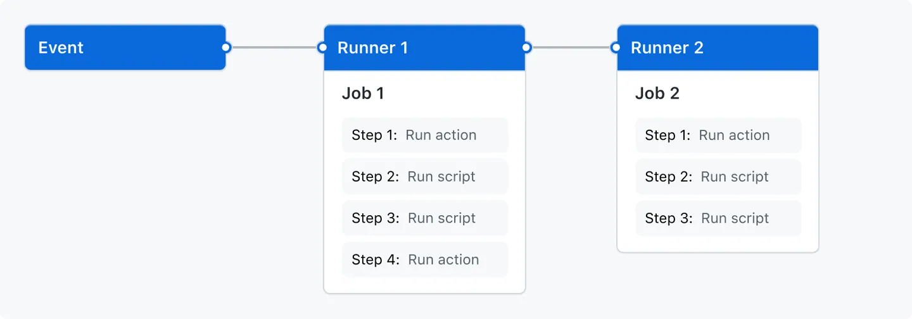

> :sparkles: This page borrows most of its content from [Understanding GitHub Actions](https://docs.github.com/en/actions/learn-github-actions/understanding-github-actions)to give you some basic understanding about GitHub Actions. For a more comprehensive reference about GitHub Actions, refer to [Learn GitHub Actions](https://docs.github.com/en/actions/learn-github-actions).

> :sparkles: You can learn about the syntax of workflow files in [Understanding the workflows Files](https://docs.github.com/en/actions/using-workflows/about-workflows#understanding-the-workflow-file) and explore [Workflow syntax for GitHub Actions](https://docs.github.com/en/actions/using-workflows/workflow-syntax-for-github-actions). You can also learn the basics of Context in [GitHub Actions Contexts](https://docs.github.com/en/actions/learn-github-actions/contexts).

## Workflow Automation

GitHub Actions is a powerful automation tool provided by GitHub that enables you to automate various tasks and workflows directly within your GitHub repository. It allows you to define custom workflows using **YAML** syntax, which can be triggered by events such as pushes, pull requests, issue creation, and more.

With GitHub Actions, you can automate tasks like building and testing your code, deploying applications, publishing packages, and managing issues and pull requests. You can create workflows to perform these tasks sequentially or in parallel, depending on your requirements.

GitHub Actions provides a wide range of pre-configured actions and workflows through the GitHub Marketplace, allowing you to easily integrate with popular tools and services. Additionally, you can create your own custom actions to encapsulate reusable tasks and share them with the community.

## The components of GitHub Actions

GitHub Actions simplifies the process of setting up and managing automation workflows, empowering developers to automate repetitive tasks and streamline their development processes directly within the GitHub ecosystem. In its core GitHub Actions uses events to trigger workflows, which then use runners to run jobs with multiple steps. A simple workflow would look like:



The core components of GitHub Actions are:

### Workflows

A workflow is a configurable automated process that will run one or more jobs. Workflows are defined by a YAML file checked in to your repository and will run when triggered by an event in your repository, or they can be triggered manually, or at a defined schedule.

Workflows are defined in the `.github/workflows` directory in a repository, and a repository can have multiple workflows, each of which can perform a different set of tasks. For example, you can have one workflow to build and test pull requests, another workflow to deploy your application every time a release is created, and still another workflow that adds a label every time someone opens a new issue.

### Jobs

A job is a set of steps in a workflow that is executed on the same runner. Each step is either a shell script that will be executed, or an action that will be run. Steps are executed in order and are dependent on each other. Since each step is executed on the same runner, you can share data from one step to another. For example, you can have a step that builds your application followed by a step that tests the application that was built.

### Steps

Steps are the individual tasks or actions that make up a job. Each step is a single command or action, such as checking out code from the repository, running a script, or calling an external service.

### Actions

Actions are reusable units of code that encapsulate a task or action. They can be used within workflows to perform common tasks, such as building code, running tests, deploying applications, and more. Actions can be created by GitHub, third-party developers, or by you, and can be shared and reused across multiple workflows and repositories.

### Events

Events trigger the execution of workflows. They can be various actions that occur within a repository, such as `push` events, `pull request` events, `issue` events, and more. Workflows are automatically triggered based on these events. You can also trigger a workflow to run on a schedule, by posting to a REST API, or manually.

### Runners

Runners are the virtual machines or containers where jobs and steps are executed. GitHub provides hosted runners with Linux, Windows, and macOS operating systems. Additionally, you can set up self-hosted runners on your own infrastructure to run workflows in environments tailored to your specific requirements.

## Getting started with workflows

GitHub Actions uses YAML syntax to define the workflow. Each workflow is stored as a separate YAML file in your code repository, in a directory named `.github/workflows`. For a quickstart with GitHub Actions, follow the below three steps:

1. In your repository, create the `.github/workflows/` directory to store your workflow files.
2. In the `.github/workflows/` directory, create a new file called `quickstart-github-actions.yaml` and add the following code.

```yaml
name: quickstart-github-actions
run-name: ${{ github.actor }} Quickstart GitHub Actions
on: [push]
jobs:
check-bats-version:
    runs-on: ubuntu-latest
    steps:
    - uses: actions/checkout@v4
    - uses: actions/setup-node@v4
        with:
        node-version: '20'
    - run: npm install -g bats
    - run: bats -v
```

3. Commit these changes and push them to your GitHub repository.

Your new GitHub Actions workflow file is now installed in your repository and will run automatically each time someone pushes a change to the repository. You can check its status in **Actions** tab.

## Video Tutorial - GitHub Actions

[](https://www.youtube.com/watch?v=TLB5MY9BBa4)

## Sources

1. [Understanding GitHub Actions](https://docs.github.com/en/actions/learn-github-actions/understanding-github-actions)
