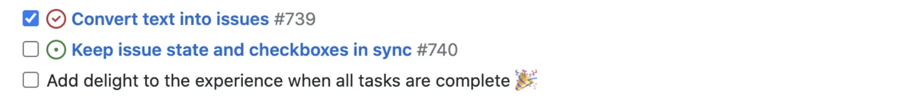

> [!IMPORTANT]
> This page focuses on Basic writing and formatting syntax in **GitHub**. This is not a Markdown reference. Refer to [Markdown Guide](https://www.markdownguide.org/) and [Markdown Basic Syntax](https://www.markdownguide.org/basic-syntax/) for a more comprehensive reference about generic Markdown Syntax.

The Page are excerpts taken from GitHub Documentation [Basic writing and formatting syntax](https://docs.github.com/en/get-started/writing-on-github/getting-started-with-writing-and-formatting-on-github/basic-writing-and-formatting-syntax). For more details and updates, refer to the original document.

## Headings

To create a heading, add one to six <kbd>#</kbd> symbols before your heading text. The number of <kbd>#</kbd> you use will determine the hierarchy level and typeface size of the heading.

```markdown
# A first-level heading
## A second-level heading
### A third-level heading
```


When you use two or more headings, GitHub automatically generates a table of contents that you can access by clicking [octicon-list-unordered-icon](https://commons.wikimedia.org/wiki/File:Octicons-list-unordered.svg) within the file header. Each heading title is listed in the table of contents and you can click a title to navigate to the selected section.


## Styling text

You can indicate emphasis with bold, italic, strikethrough, subscript, or superscript text in comment fields and `.md` files.

| Style | Syntax | Keyboard shortcut | Example | Output |
| --- | --- | --- | --- | --- |
| Bold | `** **` or `__ __`| <kbd>Command</kbd>+<kbd>B</kbd> (Mac) or <kbd>Ctrl</kbd>+<kbd>B</kbd> (Windows/Linux) | `**This is bold text**` | **This is bold text** |
| Italic | `* *` or `_ _`     | <kbd>Command</kbd>+<kbd>I</kbd> (Mac) or <kbd>Ctrl</kbd>+<kbd>I</kbd> (Windows/Linux) | `_This text is italicized_` | _This text is italicized_ |
| Strikethrough | `~~ ~~` | None | `~~This was mistaken text~~` | ~~This was mistaken text~~ |
| Bold and nested italic | `** **` and `_ _` | None | `**This text is _extremely_ important**` | **This text is _extremely_ important** |
| All bold and italic | `*** ***` | None | `***All this text is important***` | ***All this text is important*** | <!-- markdownlint-disable-line emphasis-style -->
| Subscript | `<sub> </sub>` | None | `This is a <sub>subscript</sub> text` | This is a <sub>subscript</sub> text |
| Superscript | `<sup> </sup>` | None | `This is a <sup>superscript</sup> text` | This is a <sup>superscript</sup> text |

## Quoting text

You can quote text with a <kbd>></kbd>.

```markdown
Text that is not a quote

> Text that is a quote
```

Quoted text is indented, with a different type color.


## Quoting code

You can call out code or a command within a sentence with single backticks. The text within the backticks will not be formatted. You can also press the <kbd>Command</kbd>+<kbd>E</kbd> (Mac) or <kbd>Ctrl</kbd>+<kbd>E</kbd> (Windows/Linux) keyboard shortcut to insert the backticks for a code block within a line of Markdown.

```markdown
Use `git status` to list all new or modified files that haven't yet been committed.
```


To format code or text into its own distinct block, use triple backticks.

<pre>
Some basic Git commands are:
```
git status
git add
git commit
```
</pre>


## Syntax highlighting

You can add an optional language identifier to enable syntax highlighting in your fenced code block. Syntax highlighting changes the color and style of source code to make it easier to read. For example, to syntax highlight Ruby code:

```ruby
require 'redcarpet'
markdown = Redcarpet.new("Hello World!")
puts markdown.to_html
```

This will display the code block with syntax highlighting:  


We use [Linguist](https://github.com/github-linguist/linguist) to perform language detection and to select [third-party grammars](https://github.com/github-linguist/linguist/blob/master/vendor/README.md) for syntax highlighting. You can find out which keywords are valid in [the languages YAML file](https://github.com/github-linguist/linguist/blob/master/lib/linguist/languages.yml). For more information, see "[Creating and highlighting code blocks](https://docs.github.com/en/get-started/writing-on-github/working-with-advanced-formatting/creating-and-highlighting-code-blocks)."

## Supported color models

In issues, pull requests, and discussions, you can call out colors within a sentence by using backticks. A supported color model within backticks will display a visualization of the color.

```markdown
The background color is `#ffffff` for light mode and `#000000` for dark mode.
```


Here are the currently supported color models.

| Color | Syntax | Example | Output |
| --- | --- | --- | --- |
| HEX | <code>\`#RRGGBB\`</code> | <code>\`#0969DA\`</code> |  |
| RGB | <code>\`rgb(R,G,B)\`</code> | <code>\`rgb(9, 105, 218)\`</code> |  |
| HSL | <code>\`hsl(H,S,L)\`</code> | <code>\`hsl(212, 92%, 45%)\`</code> |  |

> [!NOTE]
>- A supported color model cannot have any leading or trailing spaces within the backticks.
>- The visualization of the color is only supported in issues, pull requests, and discussions.

## Links

You can create an inline link by wrapping link text in brackets `[ ]`, and then wrapping the URL in parentheses `( )`. You can also use the keyboard shortcut <kbd>Command</kbd>+<kbd>K</kbd> to create a link. When you have text selected, you can paste a URL from your clipboard to automatically create a link from the selection.

You can also create a Markdown hyperlink by highlighting the text and using the keyboard shortcut <kbd>Command</kbd>+<kbd>V</kbd>. If you'd like to replace the text with the link, use the keyboard shortcut <kbd>Command</kbd>+<kbd>Shift</kbd>+<kbd>V</kbd>.

`This site was built using [GitHub Pages](https://pages.github.com/).`


> [!NOTE]
> GitHub automatically creates links when valid URLs are written in a comment. For more information, see "[Autolinked references and URLs](https://docs.github.com/en/get-started/writing-on-github/working-with-advanced-formatting/autolinked-references-and-urls)."

### Section links

You can link directly to a section in a rendered file by hovering over the _permalink icon_ (to the left of section heading) to expose the permalink.


### Relative links

You can define relative links and image paths in your rendered files to help readers navigate to other files in your repository. A relative link is a link that is relative to the current file. For example, if you have a README file in root of your repository, and you have another file in _docs/CONTRIBUTING.md_, the relative link to _CONTRIBUTING.md_ in your README might look like this:

```markdown
[Contribution guidelines for this project](docs/CONTRIBUTING.md)
```

GitHub will automatically transform your relative link or image path based on whatever branch you're currently on, so that the link or path always works. The path of the link will be relative to the current file. Links starting with `/` will be relative to the repository root. You can use all relative link operands, such as `./` and `../`.

Your link text should be on a single line. The example below will not work.

```markdown
[Contribution 
guidelines for this project](docs/CONTRIBUTING.md)
```

Relative links are easier for users who clone your repository. Absolute links may not work in clones of your repository - we recommend using relative links to refer to other files within your repository.

## Images

For a more comprehensive tutorial on adding images to Markdown, refer to: [DigitalOcean Tutorial Series: How To Add Images in Markdown](https://www.digitalocean.com/community/tutorials/markdown-markdown-images)

GitHub embedding images into your issues, pull requests, discussions, comments  and `.md` files. You can display an image from your repository, add a link to an online image, or upload an image. For more information, see "[Uploading assets](#uploading-assets)."

You can display an image by adding <kbd>!</kbd> and wrapping the alt text in `[ ]`. Alt text is a short text equivalent of the information in the image. Then, wrap the link for the image in parentheses `()`.

### Images from online sources

If your image is from an online source, you can use the image's _url_ link using syntax shown in below example:

```markdown

```


> [!NOTE]
> You cannot use this method for this course, all your images must be your original work which is created by yourself and uploaded as assets to your own private repositories and duly linked. See below section for more details.

### Images from assets

Here's an image:

![][image_ref_a32ff4ads]

[image_ref_a32ff4ads]: <https://myoctocat.com/assets/images/base-octocat.svg)>

> [!NOTE]
> When you want to display an image that is in your repository, use relative links instead of absolute links.

Here are some examples for using relative links to display an image.

| Context | Relative Link |
| ------ | -------- |
| In a `.md` file on the same branch | `/assets/images/electrocat.png` |
| In a `.md` file on another branch | `/../main/assets/images/electrocat.png` |
| In issues, pull requests and comments of the repository | `../blob/main/assets/images/electrocat.png?raw=true` |
| In a `.md` file in another repository | `/../../../../github/docs/blob/main/assets/images/electrocat.png` |
| In issues, pull requests and comments of another repository | `../../../github/docs/blob/main/assets/images/electrocat.png?raw=true` |

The last two relative links in the table above will work for images in a private repository only if the viewer has at least read access to the private repository that contains these images. For more information, see "[Relative Links](#relative-links)."

#### Specifying the theme for an image

You can specify the theme an image is displayed for in Markdown by using the HTML `<picture>` element in combination with the `prefers-color-scheme` media feature. We distinguish between light and dark color modes, so there are two options available. You can use these options to display images optimized for dark or light backgrounds. This is particularly helpful for transparent PNG images.

For example, the following code displays a sun image for light themes and a moon for dark themes:

```markdown
<picture>
  <source media="(prefers-color-scheme: dark)" srcset="https://user-images.githubusercontent.com/25423296/163456776-7f95b81a-f1ed-45f7-b7ab-8fa810d529fa.png">
  <source media="(prefers-color-scheme: light)" srcset="https://user-images.githubusercontent.com/25423296/163456779-a8556205-d0a5-45e2-ac17-42d089e3c3f8.png">
  
</picture>
```

## Lists

You can make an unordered list by preceding one or more lines of text with <kbd>-</kbd>, <kbd>*</kbd>, or <kbd>+</kbd>.

```markdown
- George Washington
* John Adams
+ Thomas Jefferson
```


To order your list, precede each line with a number.

```markdown
1. James Madison
2. James Monroe
3. John Quincy Adams
```


### Nested Lists

You can create a nested list by indenting one or more list items below another item.

To create a nested list using the web editor or a text editor that uses a monospaced font, like [](https://code.visualstudio.com/), you can align your list visually. Type space characters in front of your nested list item until the list marker character (<kbd>-</kbd> or <kbd>*</kbd>) lies directly below the first character of the text in the item above it.

```markdown
1. First list item
   - First nested list item
     - Second nested list item
```

> [!NOTE]
> In the web-based editor, you can indent or dedent one or more lines of text by first highlighting the desired lines and then using <kbd>Tab</kbd> or <kbd>Shift</kbd>+<kbd>Tab</kbd> respectively.


To create a nested list in the comment editor on GitHub, which doesn't use a monospaced font, you can look at the list item immediately above the nested list and count the number of characters that appear before the content of the item. Then type that number of space characters in front of the nested list item.

In this example, you could add a nested list item under the list item `100. First list item` by indenting the nested list item a minimum of five spaces, since there are five characters (`100 .`) before `First list item`.

```markdown
100. First list item
     - First nested list item
```


You can create multiple levels of nested lists using the same method. For example, because the first nested list item has seven characters (`␣␣␣␣␣-␣`) before the nested list content `First nested list item`, you would need to indent the second nested list item by at least two more characters (nine spaces minimum).

```markdown
100. First list item
       - First nested list item
         - Second nested list item
```


For more examples, see the [GitHub Flavored Markdown Spec](https://github.github.com/gfm/#example-265).

### Task lists

To create a task list, preface list items with a hyphen and space followed by `[ ]`. To mark a task as complete, use `[x]`.

```markdown
- [x] #739
- [ ] https://github.com/octo-org/octo-repo/issues/740
- [ ] Add delight to the experience when all tasks are complete :tada:
```



If a task list item description begins with a parenthesis, you'll need to escape it with <kbd>\\</kbd>:

```markdown
- [ ] \(Optional) Open a followup issue
```

For more information, see "[About task lists](https://docs.github.com/en/get-started/writing-on-github/working-with-advanced-formatting/about-task-lists)."

## Mentioning people and teams

You can mention a person or [team](https://docs.github.com/en/organizations/organizing-members-into-teams) on GitHub by typing <kbd>@</kbd> plus their username or team name. This will trigger a notification and bring their attention to the conversation. People will also receive a notification if you edit a comment to mention their username or team name. For more information about notifications, see "[About notifications](https://docs.github.com/en/account-and-profile/managing-subscriptions-and-notifications-on-github/setting-up-notifications/about-notifications)."
You can mention a person or [team](https://docs.github.com/en/organizations/organizing-members-into-teams) on GitHub by typing <kbd>@</kbd> plus their username or team name. This will trigger a notification and bring their attention to the conversation. People will also receive a notification if you edit a comment to mention their username or team name. For more information about notifications, see "[About notifications](https://docs.github.com/en/account-and-profile/managing-subscriptions-and-notifications-on-github/setting-up-notifications/about-notifications)."

> [!NOTE]
>A person will only be notified about a mention if the person has read access to the repository and, if the repository is owned by an organization, the person is a member of the organization.

```markdown
@github/support What do you think about these updates?
```


When you mention a parent team, members of its child teams also receive notifications, simplifying communication with multiple groups of people. For more information, see "[About teams](https://docs.github.com/en/organizations/organizing-members-into-teams/about-teams)."

Typing an <kbd>@</kbd> symbol will bring up a list of people or teams on a project. The list filters as you type, so once you find the name of the person or team you are looking for, you can use the arrow keys to select it and press either tab or enter to complete the name. For teams, enter the @organization/team-name and all members of that team will get subscribed to the conversation.

> [!NOTE]
> The autocomplete results are restricted to repository collaborators and any other participants on the thread.

## Referencing issues and pull requests

You can bring up a list of suggested issues and pull requests within the repository by typing <kbd>#</kbd>. Type the issue or pull request number or title to filter the list, and then press either tab or enter to complete the highlighted result.

For more information, see "[Autolinked references and URLs](https://docs.github.com/en/get-started/writing-on-github/working-with-advanced-formatting/autolinked-references-and-urls)."

## Uploading assets

You can upload assets like images by dragging and dropping, selecting from a file browser, or pasting. You can upload assets to issues, pull requests, comments, and `.md` files in your repository.

## Using emojis

You can add emoji to your writing by typing `:EMOJICODE:`, a colon followed by the name of the emoji.

`@octocat :+1: This PR looks great - it's ready to merge! :shipit:`


Typing <kbd>:</kbd> will bring up a list of suggested emoji. The list will filter as you type, so once you find the emoji you're looking for, press **Tab** or **Enter** to complete the highlighted result.

For a full list of available emoji and codes, see [the Emoji-Cheat-Sheet](https://github.com/ikatyang/emoji-cheat-sheet/blob/master/README.md).

## Paragraphs

You can create a new paragraph by leaving a blank line between lines of text.

## Footnotes

You can add footnotes to your content by using this bracket syntax:

```markdown
Here is a simple footnote[^1].

A footnote can also have multiple lines[^2].

[^1]: My reference.
[^2]: To add line breaks within a footnote, prefix new lines with 2 spaces.
  This is a second line.
```

The footnote will render like this:


> [!NOTE]
> The position of a footnote in your Markdown does not influence where the footnote will be rendered. You can write a footnote right after your reference to the footnote, and the footnote will still render at the bottom of the Markdown.

Footnotes are not supported in wikis.

## Alerts

Alerts are a Markdown extension based on the blockquote syntax that you can use to emphasize critical information. On GitHub, they are displayed with distinctive colors and icons to indicate the significance of the content.

Use alerts only when they are crucial for user success and limit them to one or two per article to prevent overloading the reader. Additionally, you should avoid placing alerts consecutively. Alerts cannot be nested within other elements.

To add an alert, use a special blockquote line specifying the alert type, followed by the alert information in a standard blockquote. Five types of alerts are available:

```markdown
> [!NOTE]
> Useful information that users should know, even when skimming content.

> [!TIP]
> Helpful advice for doing things better or more easily.

> [!IMPORTANT]
> Key information users need to know to achieve their goal.

> [!WARNING]
> Urgent info that needs immediate user attention to avoid problems.

> [!CAUTION]
> Advises about risks or negative outcomes of certain actions.
```

Here are the rendered alerts:


## Hiding content with comments

You can tell GitHub to hide content from the rendered Markdown by placing the content in an HTML comment.

<pre>
&lt;!-- This content will not appear in the rendered Markdown --&gt;
</pre>

## Ignoring Markdown formatting

You can tell GitHub to ignore (or escape) Markdown formatting by using <kbd>\\</kbd> before the Markdown character.

```markdown
Let's rename \*our-new-project\* to \*our-old-project\*.
```


